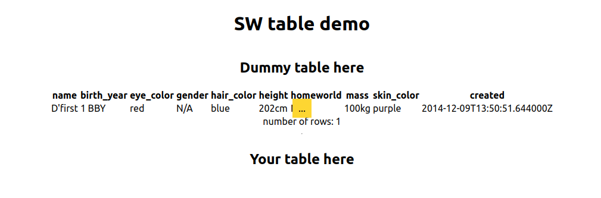

# React and PHP

Simple Star Wars table. Fetch data from an API running at localhost and display that data.



## The task

There is backend and frontend part

1. The backend part (PHP) is responsible for fetching data from external source (https://swapi.dev/api/people)
   - Allow dummy data via request parameter
   - Optional: cache swapi responses
2. The frontend part (Typescript, React) asks the backend for a data and displays it in a table
   - Create form for searching data in the table (eg. by name)
   - Optional: create paginator

## Development

### Frontend

Available at: http://localhost:3000

```sh
cd frontend
yarn install
yarn dev
```

### Backend

Available at: http://localhost:8080

```sh
cd backend
php -S localhost:8080
```

### Docker

You do not need docker for this, but you have to have `php` and `nodejs` installed.
If you want to use docker then just `docker-compose up` in project root directory.
